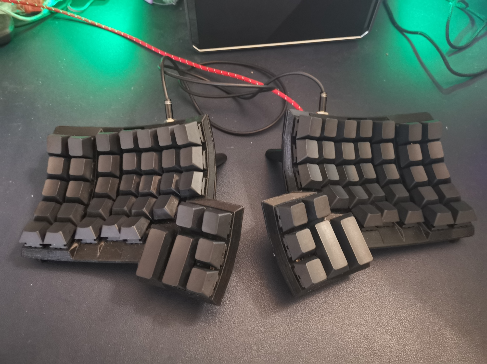
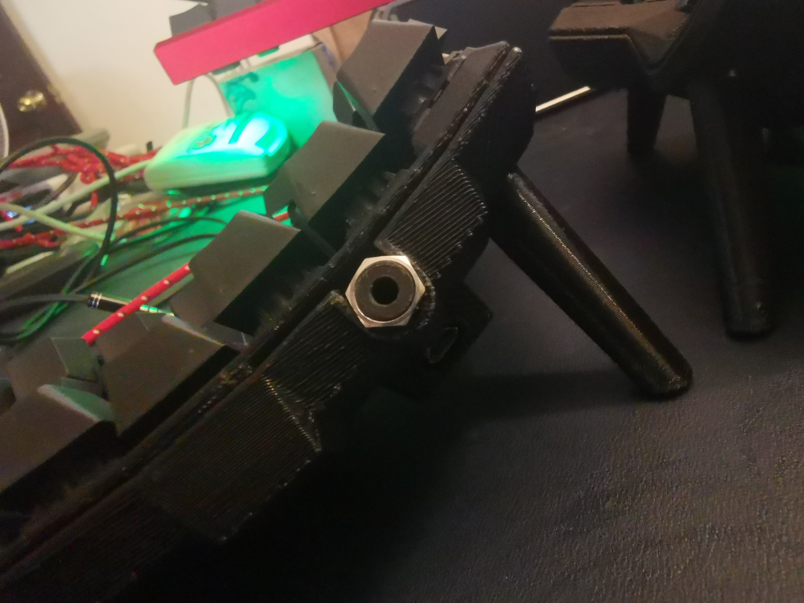

### ExDatcyl 試用報告

#### 前言
我本身工程師，所以每天用到鍵盤的機會多，自己也很喜歡嘗試各種鍵盤。目前的使用習慣，覺得鍵盤越小越好，因為手指的移動距離可以縮短(是有多懶...)，不過按鍵數又不能太少，因為組合鍵太多的話，反而又要多按按鍵，就太麻煩了，所以現在覺得60%的鍵盤是最剛好的。  

目前最喜歡的是Filco的Minila，本來在使用之前，覺得那個空白鍵那麼短，旁邊又兩個FN不知道在幹麻，用了之後，覺得那兩個FN的位置真是太對了，空白鍵是由大姆指控制，雖然大姆指 沒那麼靈活，不過也不需要那麼長，左右各放一個FN，讓左右大姆指都可以按到FN，加上大姆指本來就只有控空白鍵，等於在手完全沒有變更位置的情況下，全鍵盤都多了一層。  

之前也有用過解放大姆指概念的鍵盤 - Ergdox Infinite，它把空白鍵、Enter、Tab、backspace放到大姆指來，減少小姆指的工作量，用起來也是讓人讚賞，不過後來因為配列和一般鍵盤差太多，導致在用一般鍵盤的時候很難習慣，所以暫時就先放在一旁了。  

這次因為ExDatcyl的試用，讓我又想起了當初的美好，所以就立馬登記了，於是就有了這一篇報告。

#### 外觀

基本上就是Ergodox的立體版，本來在還沒有用之前，會覺得如果要曲面的話，為什麼不是球面，而是這樣凹面，用了之後才知道，這樣子可以有效的縮短那些外圍按鍵的距離，另外在大姆指區，因為是立體的，在Ergodox覺得很難按的四個小按鍵，現在變得更好按到了。  

  
兩邊按鍵的連接是用3.5耳機線，雖然不能像Ergodox一樣，可以單邊獨立運作，不過影響不大，連接電腦部份是使用micro usb，雖然我比較喜歡usb-c，影響也不大，基本上都是可以用的。  

#### 使用感想  
這次借用的是我的本命軸紅軸版，按起來非常滑順，害我很想請問是哪買來的，我也想要進個100顆。  
不過重點應該是手勢的體驗，前面有提到，因為凹面的關係，所以外圍的按鍵距離縮短，這就造成了在打外圍的按鍵時，手不用移動太遠，和60%比起來，雖然60%手已經不太動了，可是在打外圍區的時候，還是要移一下，可是ExDatCyl打起來的感覺是手都黏在鍵盤上，不太用動，以下附上打字的影片給大家參考。  

PS: 因為Ergodox類的鍵盤是左右分離，所以位置要自己調整一下，保持手在最舒服的姿勢，可以參考[Andy大的分享](https://ie321mx.blogspot.com/2020/04/exdactyl.html)

##### ExDaCyl
  

##### Filco Minila air
  

看起來的差別不是很大，不過實際打起來是蠻有感的。

PS: 順便說一下，另一把我的最愛是小紅點，因為連移動滑鼠，手都可以不用離開鍵盤，真的很方便。  
PS: 因為試用期已經到了，又用回一般鍵盤，又開始不習慣了。  
