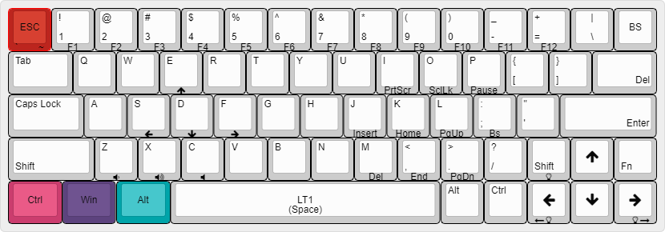
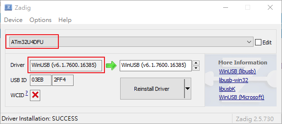
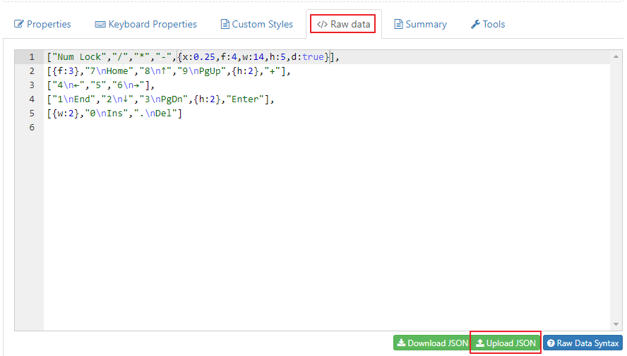
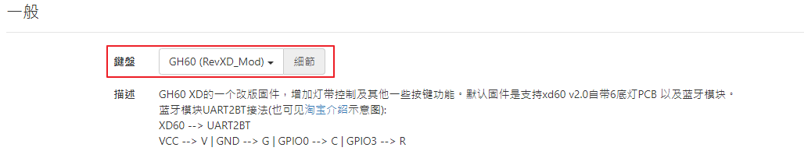
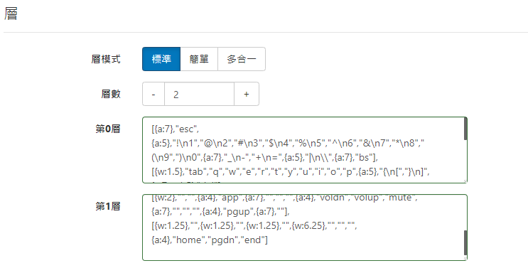
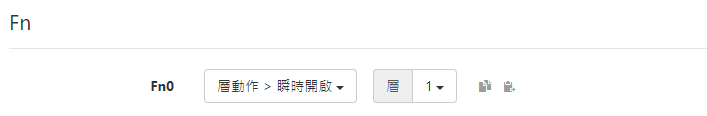
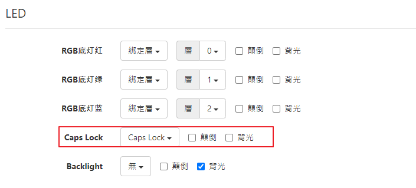
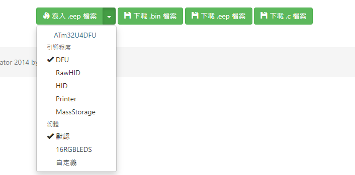

## XD60

### Current layout

### 刷鍵位步驟
- 安裝必要軟體
  1. 驅動程式 [Zadig](files/zadig-2.5.zip) ([Source](https://zadig.akeo.ie/))。
    - 安裝 WinUSB  
    - 裝置為 ATm32u4DFU  
    - 下圖要在刷機模式下才看得到(鍵盤背面的reset鍵按下去)  
      
  
  2. 用 chrome 安裝 [TKG Chrome App](https://chrome.google.com/webstore/detail/tkg-chrome-app/kmbmjdabhpdnpeobnbdchihdcdaccidi)。
  安裝完後，就可以直接刷機，不過不確定 chrome app 還可以存活多久，如果沒有的話，那就要再找刷機的軟體。  

  3. 以上兩個安裝完後，重新啟動chrome。  
  
- 到 [Keyboard Layour Editor](http://keyboard-layout-editor.com) 編輯需要的配置  
  1. 切換到 Raw data，選擇 Upload JSON，將本檔案目錄下 layout/xd60 的 layout json 檔上傳。  
    
  2. 因為等一下刷入會分層刷，所以分層編輯。  

- 到 [TMK Keymap Generator](https://yang.tkg.io)  
  1. 鍵盤選 「GH60(RevXD_Mod)」  
    
  2. 層模式選標準(分層編輯)，然後在第0層、第1層，貼上在上一步驟產生的 Json 內容。  
    
  3. Fn 的動作選 「瞬時開啟 層1」  
    
  4. LED 設定如下，主要是 「Caps Lock」 的背光選項不要勾，其它設定之後要玩燈再來研究。  
  
  5. 刷機 (刷機模式中) - 如果第一步驟所安裝的軟體都正確的話，應該可以看到像下圖一樣的情況，直接按下「寫入.eep檔案」就完成。
  
